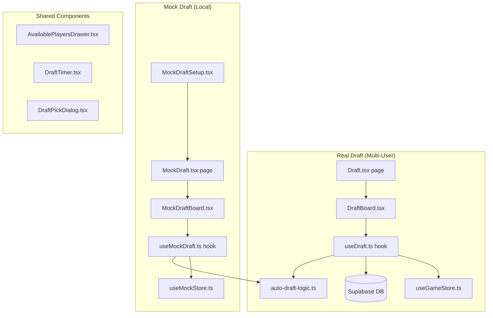

# Fantasy Draft System Reference

This document defines the **current behavior, constraints, and architecture** of both the real draft and mock draft systems.

---

## Architecture Overview



### Key Files

| File | Purpose |
|------|---------|
| `src/pages/Draft.tsx` | Real draft page (LM-gated write, read-only for others) |
| `src/pages/MockDraft.tsx` | Mock draft page (loads players from `master_players` table) |
| `src/pages/MockDraftSetup.tsx` | Setup page for mock drafts (team count, position, roster sizes) |
| `src/hooks/useDraft.ts` | Real draft hook — Supabase-backed, multi-client, RPC-based picks |
| `src/hooks/useMockDraft.ts` | Mock draft hook — local Zustand store, single-player with AI opponents |
| `src/store/useMockStore.ts` | Persisted Zustand store for mock draft state (localStorage-backed) |
| `src/lib/auto-draft-logic.ts` | Shared player selection algorithm (used by both real and mock drafts) |
| `src/lib/draft-types.ts` | TypeScript types and DB↔app mappers for draft entities |
| `src/components/DraftBoard.tsx` | Real draft grid UI + LM controls |
| `src/components/MockDraftBoard.tsx` | Mock draft grid UI + floating timer bar |
| `src/components/SharedDraftCell.tsx` | Shared cell component used by both draft boards |
| `src/components/DraftTimer.tsx` | Countdown timer component |
| `src/components/AvailablePlayersDrawer.tsx` | Drawer/Sheet for browsing and selecting available players |
| `src/lib/draft-constants.ts` | Shared constants (role abbreviations) |

---

## Snake Draft Order

Both systems use **snake draft** ordering:

- **Odd rounds** (1, 3, 5…): positions pick in order 1 → N
- **Even rounds** (2, 4, 6…): positions pick in reverse order N → 1

The function `getTeamForPick(round, pickIndex)` computes the correct team index:
```typescript
if (round % 2 === 1) return pickIndex;       // forward
return TEAMS - 1 - pickIndex;                 // reverse
```

---

## Real Draft (`useDraft.ts`)

### State Management
- **Server-authoritative**: Draft state (`draft_state` table) holds `current_round`, `current_position`, `status`, `last_pick_at`, `paused_at`, and `total_paused_duration_ms`
- **Picks**: Stored in `draft_picks` table with `pick_number` (absolute), `round`, `manager_id`, `player_id`
- **Order**: Stored in `draft_order` table with `position`, `manager_id`, `auto_draft_enabled`
- **Real-time sync**: Changes propagate to all clients via Supabase realtime subscriptions (managed in `LeagueLayout`)

### Draft Lifecycle

| Status | Description |
|--------|-------------|
| `pre_draft` | Initial state. LM assigns managers to positions and configures order |
| `active` | Draft is live. Timer runs, picks can be made |
| `paused` | Timer frozen. Server-side RPC `pause_draft` records `paused_at` |
| `completed` | All rounds filled. Rosters finalized via `sync_league_rosters` RPC |

### Pick Execution
- Manual picks go through `execute_draft_pick` RPC (server-side validation)
- The RPC returns `{ success, reason }` — handles "player already drafted" and "draft not active" soft failures
- Auto-draft picks use the same RPC with `is_auto_draft = true`; conflicts are silently logged

### Timer Behavior
- `getRemainingTime()` = `clockDuration - (now - lastPickAt) + totalPausedDurationMs`
- When `pausedAt` is set, `now` is frozen to `pausedAt` (no countdown)
- Pause/resume use server-side RPCs to avoid client clock skew
- Every 3 seconds, a tick checks if auto-draft should fire (CPU teams, auto-draft enabled, or time expired)
- A `processingPicksRef` Set + 3-second cooldown prevents concurrent auto-pick attempts
- Random jitter (0–2s) before auto-picks prevents multi-client races

### Auto-Draft Trigger Conditions
A pick is auto-drafted when ANY of:
1. The manager at this position has `auto_draft_enabled = true`
2. The manager has no associated `userId` (CPU team)
3. The timer has expired (`getRemainingTime() <= 0`)

### LM Controls (DraftBoard)
- **Randomize**: Shuffles manager assignments to draft positions
- **Start**: Sets status to `active`, initializes `last_pick_at`
- **Pause/Resume**: Server-side RPCs
- **Reset Clock**: Updates `last_pick_at` to now for the current pick
- **Auto-Complete All**: Batch-generates all remaining picks locally, inserts in one batch, then calls `sync_league_rosters` RPC + `finalizeRosters` for roster optimization

### Draft Reset
Deletes all picks, roster entries, and order assignments. Resets state to `pre_draft`. Also resets manager wins/losses/points to 0.

---

## Mock Draft (`useMockDraft.ts`)

### State Management
- **Local only**: All state in Zustand store (`useMockStore`), persisted to `localStorage`
- **No server interaction** for picks (players are fetched from `master_players` once on page load)
- Multiple mock drafts can coexist (keyed by UUID)

### Setup Configuration
From `MockDraftSetup.tsx`, the user configures:
- **Number of teams**: 8, 10, 12, or 14
- **User draft position**: Specific pick # or randomized
- **Active roster size**: 11–15
- **Bench size**: 0–8
- All other constraints (minBatWk, maxBowlers, etc.) inherit from `DEFAULT_LEAGUE_CONFIG`

### Draft Flow
1. Draft starts immediately as `in_progress` on creation
2. If user picks first in round 1, they see the drawer to select a player
3. AI teams auto-pick via `runAutoPickLoop()` with 1-second delay between picks
4. When it becomes the user's turn, the timer resets to give them the full duration
5. User picks via `makeUserPick()`, then `continueAfterUserPick()` triggers the AI loop
6. Draft completes when `currentRound > ROUNDS` (activeSize + benchSize)

### Timer
- Uses `lastPickAt` + `draftTimerSeconds` (from config, default 60s)
- Resets when the user's turn begins (after AI loop completes)
- On timeout, auto-picks the best available player for the user via `selectBestPlayer`
- Pause/resume supported (sets `pausedAt`)

### Key Differences from Real Draft

| Aspect | Real Draft | Mock Draft |
|--------|-----------|------------|
| Persistence | Supabase DB | localStorage |
| Multi-client | Yes (realtime sync) | No (single browser) |
| Pick validation | Server-side RPC | Client-side only |
| Timer sync | Server-side pause/resume RPCs | Local timestamps |
| Auto-pick delay | 3s tick + jitter | 1s fixed delay |
| Draft order | LM assigns manually or randomizes | Fixed at setup |
| Post-draft | Roster sync + optimization | No roster persistence |

---

## Auto-Draft Player Selection (`selectBestPlayer`)

The shared algorithm used by both systems:

### Steps
1. **Count roster composition**: WK, BAT, AR, BWL counts + international count
2. **Determine needed roles** (`getNeededRoles`):
   - First: roles below **minimums** (hard requirements)
   - If all mins met: roles below **maximums** (soft preferences)
3. **Filter eligible players**:
   - Primary: matches needed role AND doesn't exceed international limit
   - Fallback: any player not exceeding **max** constraints
4. **Weighted random selection** (`selectPlayerWeighted`):
   - Weight = `2^(25 - tier)` where tier = `floor(playerIndex / 10) + 1`
   - Top-10 players have tier 1 (weight 2^24), players 10-19 have tier 2 (weight 2^23), etc.
   - Heavily favors top-ranked players while maintaining variety

### Roster Constraints Enforced
| Constraint | Used In |
|-----------|---------|
| `minBatWk` | ✅ Role need priority |
| `maxBatWk` | ✅ Fallback filter |
| `minBowlers` | ✅ Role need priority |
| `maxBowlers` | ✅ Fallback filter |
| `minAllRounders` | ✅ Role need priority |
| `maxAllRounders` | ✅ Fallback filter |
| `maxInternational` | ✅ All filters |
| `requireWk` | ✅ Role need priority |

---

## UI Components

### DraftBoard (Real)
- Grid layout: columns = draft positions, rows = rounds
- Snake order rendering with `getAbsolutePickNumber(round, position)`
- Current pick cell highlighted with pulse animation
- LM can click any cell to fill it; regular users can only pick on their turn
- Floating `AvailablePlayersDrawer` for player selection
- Controls bar at top for LM actions

### MockDraftBoard
- Same grid layout, columns = team indices
- User's column visually highlighted
- Current pick shows "Click to Pick Player" CTA when it's the user's turn
- Floating action bar with pause/resume, reset clock, and countdown timer
- Completion screen with "Try Again" navigation

### AvailablePlayersDrawer
- Responsive: Sheet on desktop, Drawer on mobile
- Filters by role, nationality (domestic/international), search text
- Shows team composition debug info per manager
- Sorts players by priority ranking
- "Draft" button per player row

---

## Known Constraints & Edge Cases

1. **Draft timer granularity**: Timer ticks every 1 second for display, but auto-pick checks happen every 3 seconds (real draft) or 1 second (mock draft)
2. **Race conditions (real draft)**: Multiple clients may attempt the same auto-pick. The RPC `execute_draft_pick` handles this atomically; losing clients get soft failure responses
3. **Mock draft localStorage limits**: Large drafts (14 teams × 15 rounds = 210 picks) with full roster tracking are persisted entirely in localStorage
4. **Player pool**: Mock drafts use `master_players` table filtered to IPL teams. Real drafts use the league's `players` table
5. **No trade during draft**: The draft system does not support trading picks
6. **Auto-complete skips timer**: The "Auto-Complete All" feature in the real draft bypasses the timer and generates all remaining picks instantly
